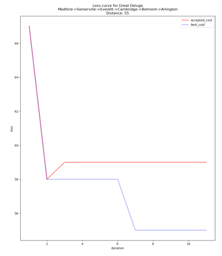
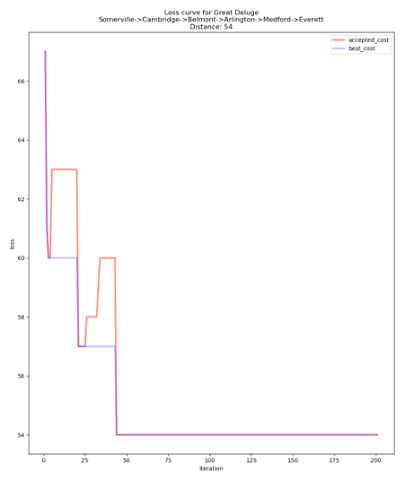
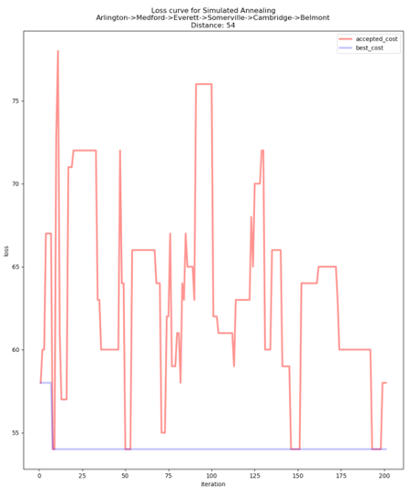

<h1>Search Algorithm Analysis</h1>
 

    <h2>Algorithms Used</h2>
    <ol>
        <li>Simulated Annealing</li>
        <li>Great Deluge</li>
    </ol>

 

    <h2>Steps</h2>
    <ol>
        <li>Run <samp>main.py</samp> file and pass some input</li>
        <li>Visualize the result using <samp>visualized.py</samp></li>
    </ol>

 

    <h2>Sample Result</h2>
     
    
     
    
     
    
     
    

